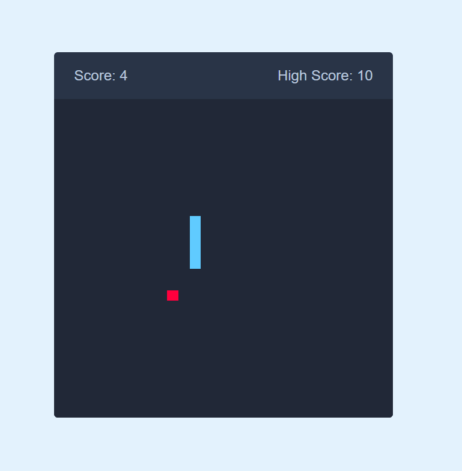

# 🐍 Snake Game

A simple and responsive **Snake Game Web Application** built using **HTML, CSS, and JavaScript**. The game recreates the classic Snake experience with keyboard controls, mobile-friendly controls, score tracking, food generation, collision detection, and high-score storage.

## 🚀 Live Demo

🔗 **[Snake Game](#)**

---

## 📌 Project Overview

The Snake Game is a browser-based game where the player controls a snake that moves around a **30 × 30 grid**.

The objective is to collect the food, increase the snake's length, and achieve the highest possible score without hitting the game-board boundaries or the snake's own body.

The game uses **JavaScript** to handle snake movement, food generation, scoring, collision detection, and user controls.

---

## ✨ Features

* 🐍 Classic Snake Game gameplay

* 🎮 Keyboard arrow-key controls

* 📱 Responsive on-screen controls

* 🍎 Random food generation

* 📈 Real-time score tracking

* 🏆 High score stored using `localStorage`

* 💥 Wall collision detection

* 🐍 Snake body collision detection

* 🔄 Automatic game restart after Game Over

* 📱 Responsive design for different screen sizes

* ⚡ Lightweight and fast

---

## 🛠️ Technologies Used

* **HTML5** – Structure of the game

* **CSS3** – Styling, layout, and responsive design

* **JavaScript** – Game logic, movement, scoring, and collision detection

* **CSS Grid** – 30 × 30 game board

* **LocalStorage** – Stores the high score

* **Font Awesome** – Directional control icons

---

## 📂 Project Structure

```text
Snake-Game/

│
├── index.html
├── styless.css
├── script.js
└── README.md
```

---

## ⚙️ How It Works

The game board is created using a **30 × 30 CSS Grid**.

JavaScript controls the snake's position using horizontal and vertical velocity values.

When the snake eats the food:

* The score increases by 1.
* The snake grows by one segment.
* A new food position is generated.
* The high score is updated if the current score is higher.

The game continuously checks for collisions with the game-board boundaries and the snake's own body.

### Score

The score starts from `0` and increases whenever the snake eats food.

### High Score

The highest score is stored in the browser using `localStorage`.
This allows the high score to remain available even after refreshing the page.

---

## 🎮 Game Controls

### Desktop

Use the keyboard arrow keys:

```text
↑  Move Up
↓  Move Down
←  Move Left
→  Move Right
```

### Mobile

Use the directional buttons displayed below the game board.

---

## 💻 How to Run Locally

1. Clone the repository:

```bash
git clone https://github.com/NileshPadalwar/Snake_Game.git
```

2. Navigate to the project folder:

```bash
cd Snake-Game
```

3. Open `index.html` in your browser.

Or, if you are using **VS Code**, open the project and run it using **Live Server**.

---

## 📸 Preview




---

## 🎯 Learning Outcomes

This project demonstrates:

* Working with JavaScript game logic

* Using CSS Grid to create a game board

* Handling keyboard events

* Handling button click events

* Generating random positions using JavaScript

* Managing arrays for snake body movement

* Implementing collision detection

* Updating the DOM dynamically

* Using `setInterval()` for continuous game movement

* Using `localStorage` to store high scores

* Creating responsive layouts using CSS media queries

---

## 👨‍💻 Author

**Nilesh Padalwar**

Frontend Developer | Angular Developer | Web Developer

---

## 📄 License

This project is created for learning and practice purposes.
